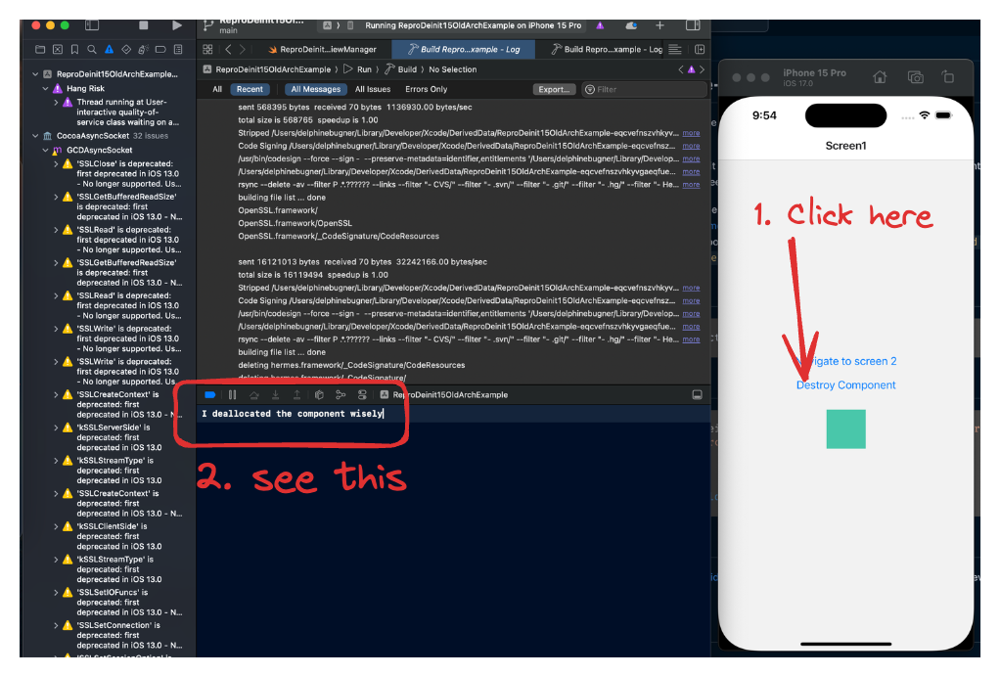
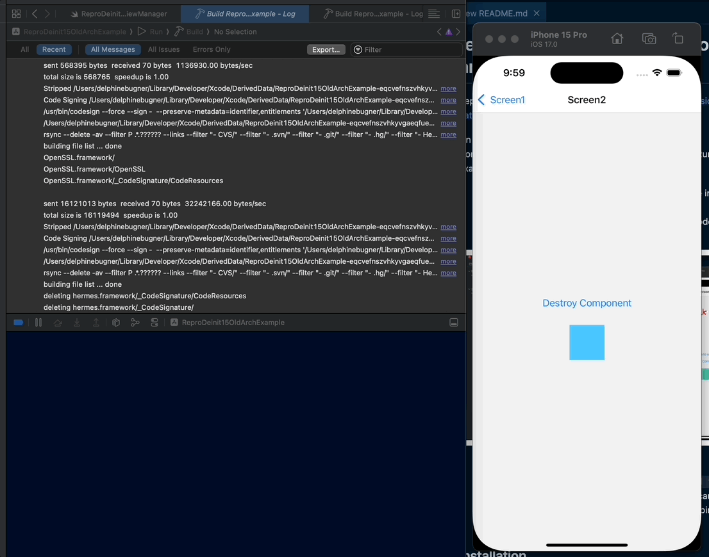
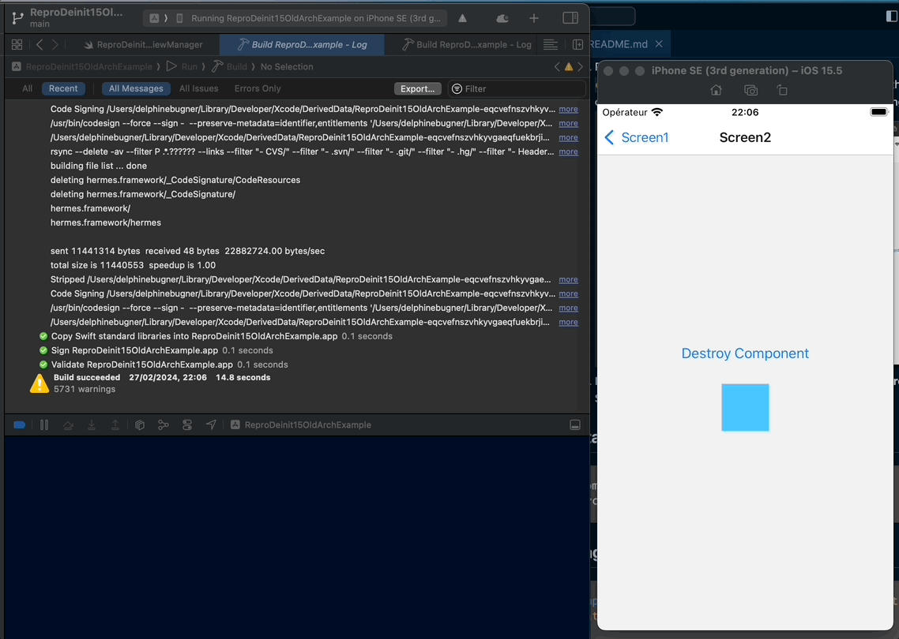

# react-native-repro-deinit-15-old-arch

Reproduction for an issue https://github.com/software-mansion/react-native-screens/issues/2007

On iOS 15, custom deinit function on custom Swift Native Components are not entered when unmounting a screen.
Run the example app to see it on action:

1. Build and open the example app on latest iOS version following the instruction on [CONTRIBUTING.md](./CONTRIBUTING.md)
2. Clic on "Destroy component", a native log appears on XCode `"I deallocated the component wisely"`



3. Go on Screen2
4. Return on Screen1: the native log `"I deallocated the component wisely"` should appear on XCode because the component has been destroyed when the screen was poping
   
5. Do the same on iOS 15.5: **the log does not appear anymore** on Screen2 pop!
   

In the real project, it's not a simple log in the deinit function but important clean up function for a native video player, so it's important to enter it!

## Usage

```js
import { ReproDeinit15OldArchView } from 'react-native-repro-deinit-15-old-arch';

// ...

<ReproDeinit15OldArchView color="tomato" />;
```

## License

MIT

---

Made with [create-react-native-library](https://github.com/callstack/react-native-builder-bob)
